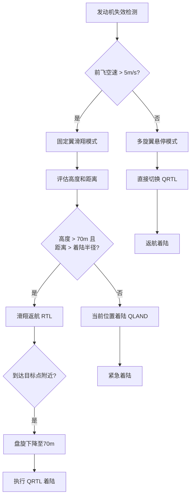

这个 Lua 脚本是 **ArduPilot 垂直起降（VTOL）飞机发动机失效应急程序**，实现了 **VTOL 四旋翼固定翼混合飞机在前飞电机失效时的智能安全返航系统**。这是**关键的故障保护机制**，让我详细分析：

## 主要功能
该脚本监控 VTOL 飞机的前飞电机状态，一旦检测到发动机失效（通过 RPM 和振动判断），自动触发**应急返航程序**，智能选择最佳着陆方案以最大化生存机会。

## 应急处理流程

### 1. **发动机失效检测**
```lua
-- 检测条件：RPM低 且 振动低，持续4秒
local ENGINE_STOPPED_MS = 4000  -- 4秒确认时间
local RPM_LOW_THRESH = 500      -- RPM低阈值
local VIBE_LOW_THRESH = 2       -- 振动低阈值

-- 避免误报：需要同时满足两个条件且持续一段时间
```

### 2. **应急响应策略**


## 核心算法

### 1. **发动机状态检测**
```lua
function check_engine()
    -- 已解锁状态下检查
    if not arming:is_armed() then
        return true  -- 未解锁时认为发动机正常
    end
    
    local rpm = RPM:get_rpm(0)  -- 获取RPM传感器0的数据
    local vibe = ahrs:get_vibration():length()  -- 获取振动幅度
    
    -- 任一条件满足则认为发动机运行
    if (rpm and (rpm > RPM_LOW_THRESH)) or (vibe > VIBE_LOW_THRESH) then
        if engine_stopped then
            gcs:send_text(0, "Engine: STARTED")  -- 发动机恢复通知
            engine_stopped = false
        end
        engine_stop_ms = -1
        return true
    end
    
    -- 开始或继续计时
    local now = millis()
    if engine_stop_ms == -1 then
        engine_stop_ms = now  -- 开始计时
    elseif now - engine_stop_ms >= ENGINE_STOPPED_MS then
        if not engine_stopped then
            engine_stopped = true
            gcs:send_text(0, "Engine: STOPPED")  -- 发动机停止确认
        end
    end
    
    return not engine_stopped
end
```

### 2. **故障安全触发**
```lua
function trigger_failsafe()
    -- 禁用任务自动着陆（避免冲突）
    if param:get('RTL_AUTOLAND') == 2 then
        param:set('RTL_AUTOLAND', 0)
    end
    
    -- 强制空速优先级（滑翔性能优化）
    if param:get('TECS_SPDWEIGHT') < 2 then
        param:set('TECS_SPDWEIGHT', 2)
    end
    
    -- 触发返航（RTL）
    vehicle:set_mode(MODE_RTL)
end
```

### 3. **智能着陆决策**
```lua
function check_qland()
    local target = vehicle:get_target_location()  -- 目标点（Home或集结点）
    local pos = ahrs:get_location()              -- 当前位置
    
    if not target or not pos then
        return  -- 无法获取位置信息
    end
    
    local dist = target:get_distance(pos)         -- 到目标点距离
    local terrain_height = terrain:height_above_terrain(true)  -- 离地高度
    local threshold = param:get('Q_FW_LND_APR_RAD')  -- 着陆接近半径
    
    -- 决策逻辑：
    -- 1. 如果在着陆半径内且高度足够低 -> QRTL（标准返航着陆）
    -- 2. 如果高度过低 -> QLAND（紧急着陆）
    if dist < threshold and terrain_height and terrain_height < LOW_ALT_THRESH then
        gcs:send_text(0, "Failsafe: LANDING QRTL")
        vehicle:set_mode(MODE_QRTL)
    elseif terrain_height and terrain_height < LOW_ALT_THRESH then
        gcs:send_text(0, "Failsafe: LANDING QLAND")
        vehicle:set_mode(MODE_QLAND)
    end
end
```

## 飞行模式定义

### 1. **固定翼相关模式**
```lua
local MODE_AUTO = 10  -- 自动任务模式
local MODE_RTL  = 11  -- 返航模式（固定翼滑翔返航）
```

### 2. **VTOL 相关模式**
```lua
local MODE_QLAND = 20  -- VTOL 当前位置着陆
local MODE_QRTL  = 21  -- VTOL 返航着陆
```

## 关键参数说明

### 1. **安全阈值**
```lua
local LOW_ALT_THRESH = 70      -- 最低安全高度（米）
local MIN_AIRSPEED = 5         -- 最小前飞空速（m/s）
```

### 2. **系统参数**
```lua
RTL_AUTOLAND      -- 返航自动着陆设置
TECS_SPDWEIGHT    -- 空速权重（0-2，2=最高优先级）
Q_FW_LND_APR_RAD  -- VTOL着陆接近半径
```

## 状态机设计

### 1. **状态变量**
```lua
local engine_stop_ms = -1      -- 发动机停止开始时间
local engine_stopped = false   -- 发动机停止状态
local triggered_failsafe = false  -- 故障安全已触发标志
```

### 2. **状态转换逻辑**
```lua
function update()
    check_engine()  -- 更新发动机状态
    
    -- 条件：发动机停止、AUTO模式、已解锁、未触发过故障安全
    if engine_stopped and vehicle:get_mode() == MODE_AUTO and 
       arming:is_armed() and not triggered_failsafe then
        triggered_failsafe = true
        trigger_failsafe()
        gcs:send_text(0, "Failsafe: TRIGGERED")
    end
    
    -- 发动机恢复时重置故障安全
    if not engine_stopped and triggered_failsafe then
        triggered_failsafe = false
        gcs:send_text(0, "Failsafe: RECOVERED")
    end
    
    -- RTL模式下检查是否需要切换着陆模式
    if triggered_failsafe and vehicle:get_mode() == MODE_RTL then
        check_qland()
    end
    
    return update, 200  -- 5Hz运行
end
```

## 应急场景处理

### 1. **高空远距离失效**
```
条件：高度 > 70m，距离 > Q_FW_LND_APR_RAD
响应：RTL滑翔返航 → 接近目标后QRTL着陆
```

### 2. **低空失效**
```
条件：高度 < 70m
响应：立即QLAND紧急着陆
```

### 3. **目标点附近失效**
```
条件：距离 < Q_FW_LND_APR_RAD，高度 > 70m
响应：盘旋下降至70m → QRTL着陆
```

### 4. **发动机恢复**
```
响应：停止应急程序，发送恢复通知
注意：已触发的模式切换不会自动恢复
```

## 技术亮点

### 1. **双重失效确认**
```lua
-- 同时使用RPM和振动传感器
-- 需要持续4秒确认，避免瞬态误报
-- 提高了可靠性，减少了虚警
```

### 2. **智能高度管理**
```lua
-- 使用地形高度而非绝对高度
-- 考虑了地形起伏对安全的影响
-- 更真实的低空判断
```

### 3. **飞行性能优化**
```lua
-- 设置TECS_SPDWEIGHT=2（最大空速权重）
-- 在滑翔中优先保持空速而非高度
-- 延长滑翔距离，增加返航成功率
```

### 4. **渐进式响应**
```lua
-- 不立即切换到多旋翼模式
-- 优先尝试滑翔返航（更远距离）
-- 只在必要时才消耗电池能量
```

## 与其他脚本的关系

### 1. **与航点脚本对比**
```lua
-- wp_test.lua: 正常任务监控
-- fw_vtol_failsafe.lua: 异常情况处理

-- 正常情况: 执行任务
-- 异常情况: 安全优先，中断任务
```

### 2. **与解锁检查脚本对比**
```lua
-- arming-check-*.lua: 预防性安全检查
-- fw_vtol_failsafe.lua: 应急反应处理

-- 预防: 飞行前检查
-- 应急: 飞行中处理故障
```

## 扩展功能建议

### 1. **风速补偿**
```lua
-- 考虑风向对滑翔能力的影响
local wind_speed = ahrs:wind_estimate()
if wind_speed > 10 then
    -- 调整滑翔策略，考虑逆风
end
```

### 2. **剩余电量考虑**
```lua
-- 考虑电池电量决定是否切换多旋翼模式
local battery_remaining = battery:capacity_remaining()
if battery_remaining < 20 then
    -- 低电量时更早切换，避免电量耗尽
end
```

### 3. **地形回避**
```lua
-- 检查着陆点地形适宜性
local terrain_type = terrain:get_terrain_type(pos)
if terrain_type == "WATER" or terrain_type == "FOREST" then
    -- 尝试寻找更好的着陆点
end
```

### 4. **通信状态监测**
```lua
-- 考虑遥控器信号丢失
if rc:has_valid_input() == false then
    -- 遥控器丢失时执行更保守的策略
end
```

### 5. **历史数据分析**
```lua
-- 记录失效事件供后期分析
logger.write('FAIL', 'Time,RPM,Vibe,Alt,Dist', 'Iffff',
             millis(), rpm, vibe, terrain_height, dist)
```

## 安全增强

### 1. **双重确认机制**
```lua
-- 添加空速确认（前飞电机失效时空速应下降）
local airspeed = ahrs:airspeed()
if airspeed > MIN_AIRSPEED and engine_stopped then
    -- 空速仍高但发动机停止，可能是传感器故障
    -- 需要额外确认
end
```

### 2. **手动覆盖选项**
```lua
-- 允许飞行员手动覆盖
local pilot_override = rc:get_channel(8)  -- 假设通道8是覆盖开关
if pilot_override > 1800 then
    -- 飞行员接管，停止自动响应
    return
end
```

### 3. **渐进式警报**
```lua
-- 分级警报系统
if now - engine_stop_ms < ENGINE_STOPPED_MS/2 then
    gcs:send_text(0, "WARNING: Engine RPM low")
elseif now - engine_stop_ms < ENGINE_STOPPED_MS then
    gcs:send_text(0, "CAUTION: Engine may have failed")
else
    gcs:send_text(0, "EMERGENCY: Engine failure confirmed")
end
```

## 测试和验证

### 1. **模拟测试场景**
```lua
-- 可以在参数中模拟失效
local test_mode = param:get('FAILSAFE_TEST') or 0
if test_mode == 1 then
    -- 模拟发动机失效（用于地面测试）
    engine_stopped = true
end
```

### 2. **飞行测试策略**
```lua
-- 建议的测试步骤：
-- 1. 地面测试（电机不转）
-- 2. 悬停测试（安全高度）
-- 3. 前飞测试（逐渐增加风险）
```

### 3. **性能指标监控**
```lua
-- 记录响应时间和决策质量
local reaction_time = millis() - engine_stop_ms
gcs:send_text(0, string.format("Reaction time: %d ms", reaction_time))
```

## 总结
这个脚本是 **VTOL 飞机安全系统的关键组件**，具有以下特点：

### 1. **生命安全优先级**
- 最大化生存机会
- 渐进式决策，避免过度反应
- 多级安全网设计

### 2. **技术先进性**
- 多传感器失效确认
- 基于能量管理的决策
- 地形感知的安全判断

### 3. **实用性**
- 适用于真实飞行场景
- 考虑了各种边界情况
- 提供了清晰的用户反馈

### 4. **可扩展性**
- 模块化设计便于增强
- 支持多种传感器输入
- 可适应不同VTOL配置

通过这个系统，VTOL飞机可以：
- 在前飞电机失效时自动执行最佳安全程序
- 根据高度和距离智能选择着陆策略
- 最大化利用剩余能量和安全机会
- 为飞行员提供清晰的状态信息和决策依据

这是一个 **航空安全工程的典范**，展示了如何通过软件智能处理复杂的飞行器故障，特别适合**商用VTOL和关键任务应用**，显著提高了VTOL飞机的安全性和可靠性。